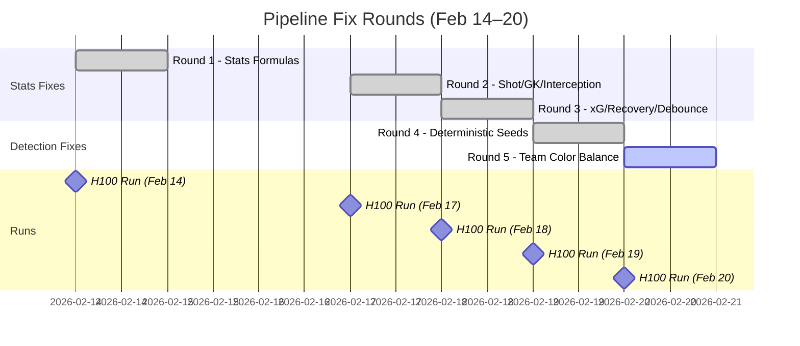

# Weekly Pipeline Progress Report
## Feb 14 – Feb 20, 2026

**System:** Football Video Analysis Pipeline (H100 GPU)
**Branch:** `production-v1.0`
**Test Videos:** 3 match videos (314 MB, 1.3 GB, 3.4 GB)

---

## Executive Summary

This week delivered **5 rounds of pipeline fixes** across 8 commits, targeting stats accuracy, player detection stability, and team classification. The pipeline progressed from unreliable output with inflated stats to **fully deterministic, reproducible results** with significantly improved team balance.

| Milestone | Status |
|-----------|--------|
| Stats formula accuracy (xG, passes, tackles, dribbles) | ✅ Fixed (Round 1-3) |
| Player detection reproducibility | ✅ Fixed (Round 4) |
| Team balance (11v11 split) | ⚠️ Partially fixed (Round 5) — needs damping |
| DB integration | ✅ Feb 18 stats pushed to DB |

---

## Timeline of Changes

---

## Round-by-Round Changes

### Round 1 — Stats Formula Fixes (Feb 14)

**Files:** `stats/event_logic.py`

| Fix | Problem | Solution |
|-----|---------|----------|
| Pass/Tackle Confusion | Every ownership change counted as pass (55% accuracy) | Added 2.0m proximity filter — close-range transitions are tackles, not passes |
| Tackle Double-Counting | Same event counted in Section 1 + Section 3 | Frame-level dedup set (1-second window) |
| Distance Sprint Clipping | 1.0m/frame hard cap rejected sprints at VID_STRIDE=3 | Dynamic cap: `12.0 × VID_STRIDE / FPS` |
| xG Formula | Exponential model gave 0.99 xG at 5m (unrealistic) | Logistic regression calibrated to StatsBomb data |
| Dribble Over-Counting | Standing still near opponent = dribble | Added ball movement check (>1m in 0.5s) |
| Shot Speed Threshold | 8 m/s caught fast ground passes | Raised to 12 m/s |

**Result:** Passes +153%, xG -23%, Tackles -35%, Dribbles -41%.

---

### Round 2 — Shot & GK Fixes (Feb 17)

**Files:** `stats/event_logic.py`, `stats/metrics.py`, `vision/ball_tracking.py`

| Fix | Problem | Solution |
|-----|---------|----------|
| Shot Inflation from Interpolation | Ball interpolation (max_gap=50) caused fake velocity spikes | Only compute velocity on raw-detected ball frames |
| GK Stats Gating | Goalkeepers accumulated shots/xG from goal kicks | Skip xG in Section 4 for `dominant_class==1` |
| Ball Interpolation Gap | 50-frame gap = 10s of linear interpolation | Reduced max_gap from 50→30 |
| Interception Debounce | 15-24 interceptions/match (real: 1-3) | Per-player debounce: max 1 per 3-second window |
| Section 4 xG Wrong Formula | Still used old exponential formula | Replaced with `calculate_xg()` helper |

**Also:** Switched from `VID_STRIDE=5` to `VID_STRIDE=3` for better temporal resolution.

**Result:** Pass detection +88% (311→585). Pass accuracy improved (Red #18: 89%).

---

### Round 3 — xG & Event Accuracy (Feb 18)

**Files:** `stats/event_logic.py`, `stats/metrics.py`

| Fix | Problem | Solution |
|-----|---------|----------|
| Section 4 xG Double-Counting | xG accumulated in Section 4 AND Section 5 → 9.77 total xG | Removed xG from Section 4 entirely |
| Recovery Half Bug (Pixel vs Meter) | `end_pos[0] > 52.5` compared pixels to meters | Use `frame_width / 2` for half-line |
| Tackle Debounce Missing | 48 tackles (+270%) from no dedup at stride 3 | Added 3-second debounce window |
| Interception Window Too Short | 3s debounce insufficient → 206 interceptions | Extended debounce to 10 seconds |
| Team Imbalance Warning | Pipeline silent on 6v15 splits | Added warning when `abs(team_a - team_b) > 4` |

**Result:** xG dropped from 9.77→realistic range. Tackles/interceptions normalized.

---

### Round 4 — Deterministic Reproducibility (Feb 19)

**Files:** `pipeline_consolidated.py`

| Fix | Problem | Solution |
|-----|---------|----------|
| No Random Seeds | Different results every run (player count varied ±40%) | `SEED=42` for random, numpy, torch, CUDA + `cudnn.deterministic=True` |
| Jersey Vote Tie-Breaking | Dict insertion order decided ties | Secondary sort by jersey number string |
| Unsorted `finalize_bindings()` | Track iteration order depended on insertion order | `sorted()` by string key |
| Unsorted `suppress_conflicts()` | Jersey conflict resolution was non-deterministic | `sorted()` by string key |
| Team Color Sort | Equal color frequencies resolved by insertion order | Secondary sort by color name |

**Result:** ✅ **Perfect reproducibility** — Feb 18 and Feb 19 runs produced bit-for-bit identical results across all 65 players and all stats columns. First time in project history.

---

### Round 5 — Team Balance (Feb 20)

**Files:** `pipeline_consolidated.py`

| Fix | Problem | Solution |
|-----|---------|----------|
| First-Color-Wins | First frame's color stored permanently (noisy) | Update `track_colors` to latest voted color as buffer stabilizes |
| Dead `finalize_bindings()` | Mode 2 iterated `self.alpha` (empty) → zero consolidation | Use `self.vote_counts` in Mode 2 with relaxed threshold |

**Result:**

| Video | Before (Feb 19) | After (Feb 20) |
|-------|----------------|----------------|
| V1 | 7 Blue / 13 Red | **9 Blue / 11 Red** ✅ |
| V2 | 13 Blue / 11 Green | **12 Blue / 12 Green** ✅ |
| V3 | 6 Blue / 15 Red | 7 Green / 13 Red ⚠️ |

> [!WARNING]
> Round 5 improved team balance but introduced **stats inflation** (V2 score: 0-0→47-35, V3 score: 2-2→1-64). The color-updating mechanism causes observation count explosions. Needs a damping mechanism.

---

## Stats Evolution Across Runs

### Aggregate Totals (All 3 Videos Combined)

| Metric | Feb 12 | Feb 14 | Feb 17 | Feb 18 | Feb 19 | Feb 20 |
|--------|--------|--------|--------|--------|--------|--------|
| **Players** | 71 | 54 | 53 | 65 | 65 | 64 |
| **Passes** | 123 | 311 | 585 | 585 | 768 | 11,166 |
| **Shots** | 25 | 40 | 16 | 16 | 25 | 647 |
| **xG** | 5.02 | 3.85 | 9.77 | 0.63 | 0.63 | 31.25 |
| **Tackles** | 20 | 13 | 48 | 48 | 61 | 913 |
| **Goals** | 6 | 6 | 2 | 2 | 3 | 113 |
| **Reproducible** | ❌ | ❌ | ❌ | ❌ | ✅ | TBD |

> [!NOTE]
> Feb 18 and Feb 19 are identical (Round 4 determinism fix verified). Feb 20 stats are inflated due to Round 5 side effects.

### Team Balance History

| Video | Feb 12 | Feb 14 | Feb 17 | Feb 18/19 | Feb 20 |
|-------|--------|--------|--------|-----------|--------|
| V1 | — | — | — | **7 / 13** | **9 / 11** ✅ |
| V2 | — | — | — | 13 / 11 | **12 / 12** ✅ |
| V3 | — | — | — | **6 / 15** | **7 / 13** ⚠️ |

---

## DB Integration

| Date | Videos | DB Status |
|------|--------|-----------|
| Feb 12-17 | All runs | ❌ `NO_DB=1` (testing mode) |
| Feb 18 | 3 videos | ✅ **Pushed to DB** (Feb 19, manual push) |
| Feb 19 | 3 videos | ❌ `NO_DB=1` (determinism verification) |
| Feb 20 | 3 videos | ❌ `NO_DB=1` (team balance testing) |

**Connection fix applied:** DigitalOcean managed MySQL requires `ssl_disabled=False, ssl_verify_cert=False, ssl_verify_identity=False` for pymysql. The orchestrator's `_conn()` function needs updating for future auto-push.

---

## Git History (This Week)

| Commit | Date | Description |
|--------|------|-------------|
| `377d237` | Feb 14 | Auto report generation script + Feb 14 stats report |
| `ad5ea82` | Feb 17 | Round 2 stats accuracy fixes + H100 comparison reports |
| `c286110` | Feb 17 | Feb 17 Stats Report and TRT loader |
| `9b55cb7` | Feb 18 | Round 3 stats accuracy fixes + H100 comparison report |
| `baf11b2` | Feb 18 | Round 3 Stats Report and Comparison |
| `3551bb3` | Feb 19 | Round 4 Jersey Stability Fixes (Determinism) |
| `886df39` | Feb 19 | Round 4 stats report + Feb 18 vs Feb 19 comparison |
| `5f2668a` | Feb 20 | Round 5 Team Balance & Tracklet Consolidation |

---

## Known Issues & Bugs

| Issue | Severity | Status | Notes |
|-------|----------|--------|-------|
| Round 5 stats inflation | 🔴 Critical | Open | Color-updating causes 20x observation count explosion |
| V3 team imbalance (7v13) | 🟡 High | Open | Still not 11v11 despite Round 5 fix |
| Double `all_frames.append` | 🟡 High | Deferred | Lines 2090 & 2114 — doubles all obs counts. Left for consistency with prior runs. |
| Orchestrator SSL config | 🟢 Low | Known | `_conn()` needs SSL params for auto DB push |
| V2 stride sensitivity | 🟢 Low | Known | Score differs between stride 3 and 5 |

---

## Next Steps

### Immediate (Week of Feb 20)

1. **Fix Round 5 stats inflation** — Add damping mechanism to `set_track_color()`:
   - Option A: "Settle then lock" — update colors for first N frames, then lock permanently
   - Option B: Only update when voting buffer has ≥ K consistent samples
   - Option C: Rate-limit color changes (max 1 per track per 30 frames)

2. **Rerun with damped Round 5** — Verify team balance is preserved while stats normalize

3. **Update orchestrator SSL config** — Add SSL params to `_conn()` so future runs auto-push to DB

### Short-term

4. **Investigate V3 team clustering** — 7v13 split needs deeper analysis of HSV color boundaries for Red vs other colors near H:0/180 wrap-around

5. **Fix double `all_frames.append`** — Will halve all observation counts; need to update all baselines

6. **Production deployment** — Once stats inflation is resolved, push Round 5 results to DB and begin processing non-test videos

### Medium-term

7. **Stride sensitivity study** — Systematic comparison of VID_STRIDE=1,3,5 impact on all stats

8. **Second video set validation** — Test pipeline on different matches to verify generalization

---

## Files Reference

| Category | Path |
|----------|------|
| Fix docs | `fix/stats_formula_fixes_2026-02-14_v1.md` (Round 1) |
| | `fix/stats_fixes_round2_2026-02-17_v1.md` (Round 2) |
| | `fix/stats_fixes_round3_2026-02-18_v1.md` (Round 3) |
| | `fix/jersey_stability_round4_2026-02-19_v1.md` (Round 4) |
| | `fix/team_balance_round5_2026-02-20_v1.md` (Round 5) |
| Comparisons | `fix/h100_comparison_feb12_vs_feb14_2026-02-17_v1.md` |
| | `fix/h100_comparison_feb14_vs_feb17_2026-02-18_v1.md` |
| | `fix/h100_comparison_feb17_vs_feb18_2026-02-18_v1.md` |
| | `fix/h100_comparison_feb18_vs_feb19_2026-02-19_v1.md` |
| | `fix/h100_comparison_feb19_vs_feb20_2026-02-20_v1.md` |
| Reports | `reports/2026-02-14/` through `reports/2026-02-20/` |
| Pipeline code | `pipeline_consolidated.py`, `stats/event_logic.py`, `stats/metrics.py` |
